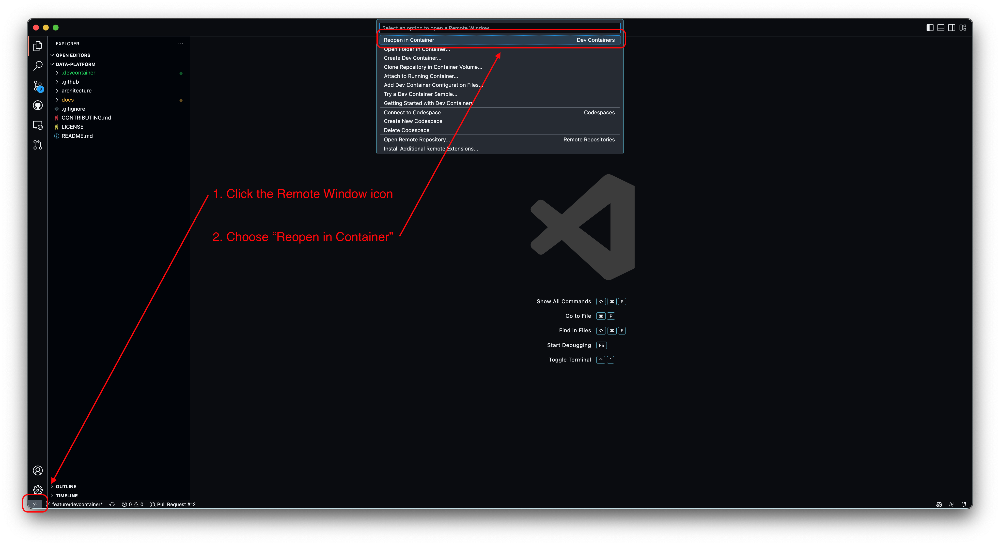

# Data Platform Development Container

This implementation of the development container is meant to have all repositories cloned into it under the persistent workspace `/home/vscode/workspace`. Once we begin our journey to the monorepo, this should become redundant. That means that right now, it is not intended to use this with GitHub Codespaces.

# Prerequisites

* macOS

* Homebrew

    ```bash
    /bin/bash -c "$(curl -fsSL https://raw.githubusercontent.com/Homebrew/install/HEAD/install.sh)"
    ```

* Docker for Mac or Rancher Desktop

    ```bash
    brew install --cask docker
    # or
    brew install --cask rancher
    ```

* Node / NPM

    ```bash
    brew install node
    ```

* devcontainer CLI

    ```bash
    npm install --global @devcontainers/cli@latest
    ```

* Visual Studio Code

    ```bash
    brew install --cask visual-studio-code
    ```

  * Dev Containers Extension

    This command could fail as `code` might not be in your `${PATH}` yet, if that is the case, install it via Visual Studio Code's UI

    ```bash
    /usr/local/bin/code --install-extension ms-vscode-remote.remote-containers
    ```

---

# Using

1. Update your `~/.bashrc` or `~/.zshrc` to export your AWS IAM email address (Temporary until we all use AWS SSO)

    ```bash
    export MOJ_DATA_PLATFORM_AWS_IAM_EMAIL="firstname.lastname@digital.justice.gov.uk"
    ```

1. Launch Visual Studio Code

1. Reopen in Container

    

---

# Tools

## AWS Vault

1. Configure Landing Account

    ```bash
    $ aws-vault add analytical-platform-landing
    ```

## Kubernetes CLI

The supplied `~/.kube/config`:

  1. Invokes a wrapper for authenticating to EKS using AWS Vault. If you're in an AWS Vault sub-shell, it will not call AWS Vault

  1. Has the default context to the development EKS cluster

---

# Developing

## Testing a feature

1. Run script

    ```bash
    bash .devcontainer/hack/feature-test.sh ${FEATURE_NAME}
    ```

### Debugging a feature

1. Run base image

    ```bash
    docker run -it --rm \
      --volume $( pwd ):/workspace \
      --volume $( pwd )/.devcontainer/features/src/base/devcontainer-utils:/usr/local/bin/devcontainer-utils \
        mcr.microsoft.com/devcontainers/base:ubuntu
    ```

1. Test feature

    ```bash
    bash -x /workspace/.devcontainer/features/src/<feature>/install-<tool>.sh
    ```
