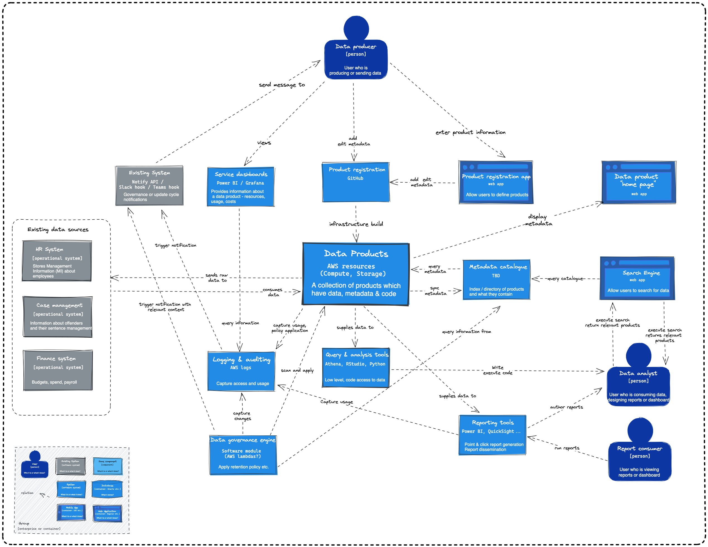

---
eleventyNavigation:
  key: Architecture diagrams
  parent: Tech Docs
  order: 2
aria-hidden: false
layout: sub-navigation
title: Architecture diagrams
includeInBreadcrumbs: true
description: Visual representations of the Data Platform's underlying architecture
---

This page documents the technical architecture diagrams that make up the Data Platform. If you would like to contribute please see the [contributing and updating](#contributing-and-updating) guidance at the bottom of this page.

## C4 Model Diagrams

In the [C4 model](https://c4model.com/), the four C's represent [context](https://c4model.com/#SystemContextDiagram), [containers](https://c4model.com/#ContainerDiagram), [components](https://c4model.com/#ComponentDiagram), and [code](https://c4model.com/#CodeDiagram). These different levels help you tell the right story to the right audience. These diagrams are for people inside and outside of the the Data Platform team and technical and non-technical people.

### Level 1 - Context Diagram

This is the highest level of abstraction and provides an overview of the entire system. It shows the system under consideration and its external dependencies, such as users, external systems, and APIs. Frequency in change is likely minimal compared to other levels.

### Level 2 - Minimum Viable Product Diagram

This diagram shows the components that we are going to deploy as part of our minimum viable product. [MVPs](https://defradigital.blog.gov.uk/2018/03/14/how-showing-the-thing-helped-us-simplify-our-mvp/) play a vital role in service development. By aiming to release our product as early as possible, we reduce the risk of never releasing it at all. We also get valuable feedback from our users who are using the system in a real-world situation.

### Level 2 - Container Diagram

This level focuses on the software system's high-level [containers](https://c4model.com/#ContainerDiagram), which are typically applications or services. It illustrates the major components of the system and their interactions. Web servers, databases, desktop and mobile applications are all examples of containers.

### Level 3 - Component

This level delves deeper into the containers identified in the previous level. It shows the internal components and their interactions within each container. Components can represent classes, modules, services, or other logical units.

#### 3.1 Data Product Component - Proposal

This diagram shows the relationships of a Data Product with other components of the Data Platform.

## Contributing and updating

We created these diagrams using the open source tool [Excalidraw](https://docs.excalidraw.com/). The files have `.png` appended onto the filename, e.g `diagram.excalidraw.png`. This allows the editors below to manipulate and version the files without the need to export after every change.

If you would like to edit Excalidraw files, then use one of the following methods.

- On the web using [vscode.dev](https://github.dev/ministryofjustice/data-platform/tree/main/docs/diagrams) with the [Excalidraw extenstion](https://marketplace.visualstudio.com/items?itemName=pomdtr.excalidraw-editor)

> Recommended for small changes, requires no software.

- Using [Visual Studio Code](https://code.visualstudio.com/download) with the [Excalidraw extension](https://marketplace.visualstudio.com/items?itemName=pomdtr.excalidraw-editor)

> Recommended for creating diagrams.

- Using the web version of [Excalidraw](https://excalidraw.com/) and opening the the cloned, or downloaded [files](https://github.com/ministryofjustice/data-platform/tree/main/docs/source/documentation/diagrams)

> Recommended for small group sessions using [live collaboration](https://blog.excalidraw.com/building-excalidraw-p2p-collaboration-feature/)
