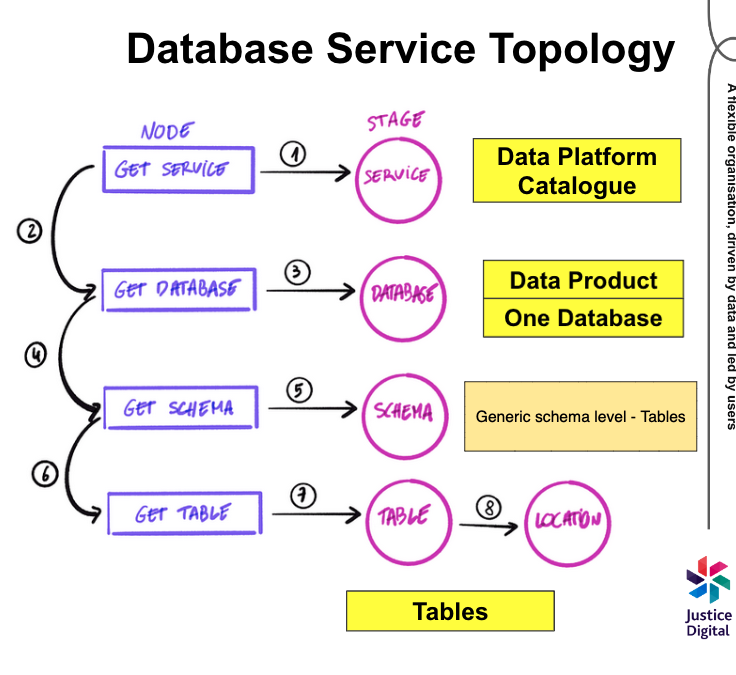

# Data platform catalogue

This library is part of the Ministry of Justice data platform.

It provides functionality to publish object metadata to the OpenMetadata data catalogue
so that data products are discoverable.

## How to install

To install the package using `pip`, run:

```shell
pip install ministryofjustice-data-platform-catalogue
```

## Topology

- Each internal data platform catalogue is mapped to a database in the
  OpenMetadata catalogue
- Each data product is mapped to a schema
- Each table is mapped to a table



## Example usage

```python
from data_platform_catalogue import (
  CatalogueClient, CatalogueMetadata,
  DataProductMetadata, TableMetadata
)

client = CatalogueClient(
    jwt_token="***",
    api_uri="https://catalogue.apps-tools.development.data-platform.service.justice.gov.uk/api"
)

assert client.is_healthy()


catalogue = CatalogueMetadata(
  name = "data_platform",
  description = "All data products hosted on the data platform",
)

data_product = DataProductMetadata(
    name = "my_data_product",
    description = "bla bla",
    version = "v1.0.0",
    owner = "7804c127-d677-4900-82f9-83517e51bb94",
    email = "justice@justice.gov.uk",
    retention_period_in_days = 365,
    domain = "legal-aid",
    dpia_required = False
)

table = TableMetadata(
  name = "my_table",
  description = "bla bla",
  column_types = {"foo": "string", "bar": "int"},
  retention_period_in_days = 365
)

service_fqn = client.create_or_update_database_service(name="data_platform")
database_fqn = client.create_or_update_database(metadata=catalogue, service_fqn=service_fqn)
schema_fqn = client.create_or_update_schema(metadata=data_product, database_fqn=database_fqn)
table_fqn = client.create_or_update_table(metadata=table, schema_fqn=schema_fqn)
```
